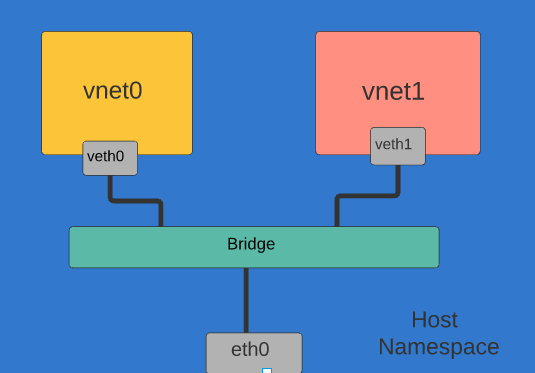

# Namespace


Container runtime uses the namespace kernel feature to partition system resources to achieve a form of process isolation, such that changes to the resources in one namespace do not affect that in other namespaces. Example of such resources include process IDs, hostnames, user IDs, file names, and network interfaces.

Network namespace, in particular, virtualizes the network stack. Each network namespace has its own set of resources like network interfaces, IP addresses, routing tables, tunnels, firewalls etc. For example, iptables rules added to a network namespace will only affect traffic entering and leaving that namespace.

# Configure the 1st Network Namespace

Our first task is to create a new pair of veth interfaces, veth0 and veth1, by using the ip link add command:

```bash
# create the pair of veth interfaces named, veth0 and veth1
ip link add veth0 type veth peer name veth1

```


The veth interfaces are usually created as interconnected pairs, where data transmitted on one end is immediately received on the other end. This type of interfaces is commonly used in container runtime to transfer packets between different network namespaces.

Let’s create our first network namespace, vnet0. Then we can assign the veth0 interface to this network namespace,

```bash
# create the vnet0 network namespace
ip netns add vnet0

# create the vnet1 network namespace
ip netns add vnet1


```


# Configure the 2nd Network Namespace

We will reuse the above commands to create our second network namespace, vnet1. Then we assign the veth1 interface to this network namespace, 

```bash
# assign the veth0 interface to the vnet0 network namespace
ip link set veth0 netns vnet0

# assign the veth1 interface to the vnet1 network namespace
ip link set veth1 netns vnet1

```


ip netns exec, is how you execute commands in a different network namespace.allocate the 10.0.2.0/24 IP address range to this interface:
However, we can’t ping either of the veth pairs from their peer network namespace

The route tables in both network namespaces only have route entries for their respective subnet IP range. They have no routes to other subnets. We can insert new route entries into the route tables using the ip route add command.

This configuration is not efficient because with the increase of namespace we need more complex connection to be configured. As a solution linux bridge is used.

A Linux bridge behaves like a network switch. It forwards packets between interfaces that are connected to it. It’s usually used for forwarding packets on routers, on gateways, or between VMs and network namespaces on a host.


