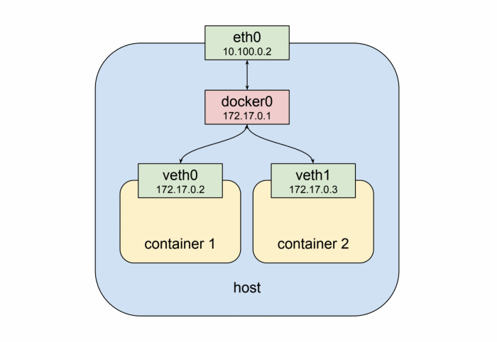

# Namespace

In a single-user computer, a single system environment may be fine. But on a server, where you want to run multiple services, it is essential to security and stability that the services are as isolated from each other as possible. Imagine a server running multiple services, one of which gets compromised by an intruder. In such a case, the intruder may be able to exploit that service and work his way to the other services, and may even be able compromise the entire server. Namespace isolation can provide a secure environment to eliminate this risk.

For example, using namespacing, it is possible to safely execute arbitrary or unknown programs on your server. Recently, there has been a growing number of programming contest and “hackathon” platforms, such as HackerRank, TopCoder, Codeforces, and many more. A lot of them utilize automated pipelines to run and validate programs that are submitted by the contestants. It is often impossible to know in advance the true nature of contestants’ programs, and some may even contain malicious elements. By running these programs namespaced in complete isolation from the rest of the system, the software can be tested and validated without putting the rest of the machine at risk. Similarly, online continuous integration services, such as Drone.io, automatically fetch your code repository and execute the test scripts on their own servers. Again, namespace isolation is what makes it possible to provide these services safely.


Container runtime uses the namespace kernel feature to partition system resources to achieve a form of process isolation, such that changes to the resources in one namespace do not affect that in other namespaces. Example of such resources include process IDs, hostnames, user IDs, file names, and network interfaces.

Network namespace, in particular, virtualizes the network stack. Each network namespace has its own set of resources like network interfaces, IP addresses, routing tables, tunnels, firewalls etc. For example, iptables rules added to a network namespace will only affect traffic entering and leaving that namespace.

# Configuring Network Namespace

Our first task is to create a new pair of veth interfaces, veth0 and veth1, by using the ip link add command:

```bash
# create the pair of veth interfaces named, veth0 and veth1
ip link add veth0 type veth peer name veth1

```
<br> 

<br> <br>

The veth interfaces are usually created as interconnected pairs, where data transmitted on one end is immediately received on the other end. This type of interfaces is commonly used in container runtime to transfer packets between different network namespaces.

Let’s create our first network namespaces, vnet0. 

```bash
# create the vnet0 network namespace
ip netns add vnet0

# create the vnet1 network namespace
ip netns add vnet1


```
<br> 
 <br> <br>


Now we can assign the veth0 interface to vnet0 namespace. Then we assign the veth1 interface to vnet1. 

```bash
# assign the veth0 interface to the vnet0 network namespace
ip link set veth0 netns vnet0

# assign the veth1 interface to the vnet1 network namespace
ip link set veth1 netns vnet1

```


<br> <br>


Then IP address range is allocated to these interfaces. 
However, we can’t ping either of the veth pairs from their peer network namespace

The route tables in both network namespaces only have route entries for their respective subnet IP range. They have no routes to other subnets. We can insert new route entries into the route tables using the ip route add command. To execute commands in a different network namespace ip netns exec, is used. 

This configuration is not efficient because with the increase of namespace we need more complex connection to be configured. As a solution linux bridge is used.

A Linux bridge behaves like a network switch. It forwards packets between interfaces that are connected to it. It’s usually used for forwarding packets on routers, on gateways, or between VMs and network namespaces on a host.


 <br>

# Bridge mode in Docker


<br>

Bridge mode is the default network driver and is usually used for apps running in standalone containers. The Docker daemon creates “docker0” a virtual Ethernet bridge that forwards packets between all interfaces attached to it. All containers on the host are attached to this internal bridge which assigns one interface as the containers’ “eth0” interface and another interface in the host’s namespace. Because the containers are in their own namespace, they have their own port space and don’t have to worry about port conflicts. But the containers are still exposed outside the host using the host’s IP address. This requires the use of NAT which is implemented by using Linux iptables, which limits the scale and performance of the solution.

