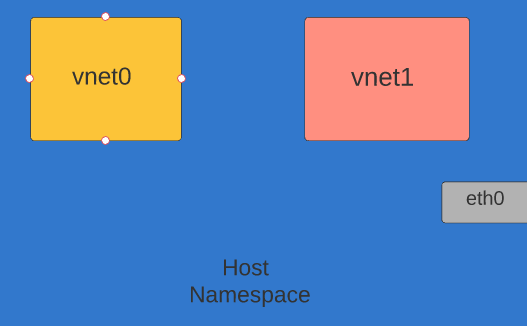
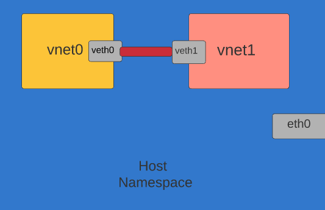
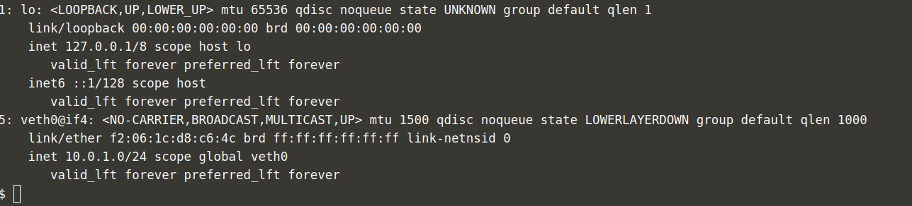

# Namespace

```bash
# create the pair of veth interfaces named, veth0 and veth1
ip link add veth0 type veth peer name veth1

```




```bash

# confirm that veth0 is created
ip link show veth0

```



```bash

# create the vnet0 network namespace
ip netns add vnet0

# assign the veth0 interface to the vnet0 network namespace
ip link set veth0 netns vnet0

# assign the 10.0.1.0/24 IP address range to the veth0 interface
ip -n vnet0 addr add 10.0.1.0/24 dev veth0

# bring up the veth0 interface
ip -n vnet0 link set veth0 up

# bring up the lo interface, because packets destined for 10.0.1.0/24
# (like ping) goes through the "local" route table
ip -n vnet0 link set lo up 

# confirm that the interfaces are up
ip -n vnet0 addr show

```


```bash

```


```bash

```


```bash

```

```bash

```

